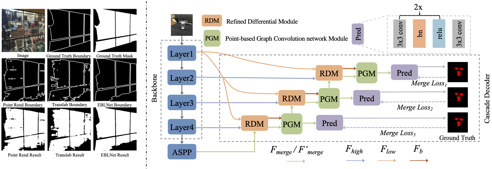

# EBLNet
This repo contains the the implementation of Our ICCV-2021 work: Enhanced Boundary Learning for Glass-like Object Segmentation.

This is a join work of Institute of Automation, Chinese Academy of Sciences, Peking University, and Sensetime Research. Much thanks for Sensetime's GPU clusters.

[paper](https://openaccess.thecvf.com/content/ICCV2021/html/He_Enhanced_Boundary_Learning_for_Glass-Like_Object_Segmentation_ICCV_2021_paper.html)


Any Suggestions/Questions/Pull Requests are welcome.
  



The master branch works with PyTorch 1.5 and python 3.7.6


# DataSet preparation
Dataloaders for Trans10k, MSD, and GDD are available in [datasets](./datasets). 
Details of preparing each dataset can be found at [PREPARE_DATASETS.md](./DATASETs.md)


# Model Checkpoint

## Pretrained Models

Baidu Pan Link: https://pan.baidu.com/s/15-ldYHk-__VI0ZhLMUFPzA (bpkw) 

Google Drive Link: https://drive.google.com/drive/folders/1S6Mv_559_0u851OOXbVyGXgvFCNoMknj?usp=sharing

After downloading the pretrained backbones, you can either change the path in `network/resnet_d.py` (for ResNet50 and ResNet101) 
and `network/resnext.py` (for ResNeXt101), or do soft link according to the default path in `network/resnet_d.py` and `network/resnext.py`.

For example, suppose you store the pretrained model at `~/user_name/pretrained_models`, 
you can `ln -s ~/user_name/pretrained_models/* ~/user_name/codes/EBLNet/pretrained_models`

or you can update the model path in `resnet_d.py` and `resnext.py`, like ResNet50 in Line281 of `network/resnet_d.py`,

`model.load_state_dict(torch.load("~/user_name/pretrained_models/resnet50-deep.pth", map_location='cpu'))`

## Trained Models and CKPTs

Here are the trained models reported in our paper, you can use them to evaluate.

<table><thead><tr><th>Dataset</th><th>Backbone</th><th>mIoU</th><th>Model</th></tr></thead><tbody>
<tr><td>Trans10k</td><td>ResNet50 (os16)</td><td>89.58</td><td><a href="https://drive.google.com/file/d/1zWnFh2jxmJdEos5fJcpjt7r3YzdnNMY-/view?usp=sharing" target="_blank" rel="noopener noreferrer">Google Drive</a>&nbsp;|&nbsp;<a href="https://pan.baidu.com/s/1qejx80xzmP2CMMi8-5AgWw" target="_blank" rel="noopener noreferrer">Baidu Pan</a>(7eg1)</td></tr>
<tr><td>Trans10k</td><td>ResNet50 (os8)</td><td>90.28</td><td><a href="https://drive.google.com/file/d/16l8RprH4Gpp1-HR1ujGU8GxbKAJWBbg0/view?usp=sharing" target="_blank" rel="noopener noreferrer">Google Drive</a>&nbsp;|&nbsp;<a href="https://pan.baidu.com/s/1vq2BGZ8omlXtmvj-AvE3-A" target="_blank" rel="noopener noreferrer">Baidu Pan</a>(5aaf)</td></tr>
<tr><td>GDD</td><td>ResNet101</td><td>88.16</td><td><a href="https://drive.google.com/file/d/1vWvxVwETCSZBnKEaNADZvPQaDJpvD0kE/view?usp=sharing" rel="noopener noreferrer">Google Drive</a>&nbsp;|&nbsp;<a href="https://pan.baidu.com/s/1At2c0YLEDzXNCY-7r5Y_TA" target="_blank" rel="noopener noreferrer">Baidu Pan</a>(fq6a)</td></tr>
<tr><td>GDD</td><td>ResNeXt101</td><td>88.72</td><td><a href="https://drive.google.com/file/d/1sZfkR9fGWJ0XnB8YjnM2oDFqRBIYhxYZ/view?usp=sharing" rel="noopener noreferrer">Google Drive</a>&nbsp;|&nbsp;<a href="https://pan.baidu.com/s/1nIBcOMx4vw0YY6pt0KrTkg" target="_blank" rel="noopener noreferrer">Baidu Pan</a>(fi6v)</td></tr>
<tr><td>MSD</td><td>ResNet101</td><td>78.84</td><td><a href="https://drive.google.com/file/d/18kEPJNmi7W854HZtaU8rOFhAJ3SUQk1m/view?usp=sharing" rel="noopener noreferrer">Google Drive</a>&nbsp;|&nbsp;<a href="https://pan.baidu.com/s/1iMCT5BFjhAuuZ4qZrvrelw" target="_blank" rel="noopener noreferrer">Baidu Pan</a>(t9pr)</td></tr>
<tr><td>MSD</td><td>ResNeXt101</td><td>80.33</td><td><a href="https://drive.google.com/file/d/1x9AJOm2a015TlySQck25Aw_GP4SGYVxz/view?usp=sharing" rel="noopener noreferrer">Google Drive</a>&nbsp;|&nbsp;<a href="https://pan.baidu.com/s/1mgYV5C9tzU928eNx40vxMQ" target="_blank" rel="noopener noreferrer">Baidu Pan</a>(pvs2)</td></tr>

</tbody></table>


## Evaluation
After downloading the trained models, you can evaluate the models with the evaluation scripts, for example, when evaluating the EBLNet (ResNet50 as backbone) on test set of Trans10k dataset:
```bash
sh scripts/test/test_Trans10k_R50_EBLNet.sh path_to_checkpoint path_to_save_results
```
After running this script, you can get the iou of things and stuff are 92.73 and 87.82, respectively. Thus, the mIoU is 90.28 as reported in the last line of out paper Table. 2. Note that, when computing the mean IoU, we **do not** include the background.

During evaluation, if you want to save images during evaluating for visualization, all you need to do is add args: `dump_images` in the test scripts. Note that, saving images will take more time.

## Training
To be note that, all our models are trained on 8 V-100 GPUs with 32G memory. **It is hard to reproduce the results if you do not have such
resources.** For example, when training EBLNet with ResNet50 (os8) as backbone on the Trans10k dataset:
```bash
sh scripts/train/train_Trans10k_R50_EBLNet.sh
```

## Citation
If you find this repo is helpful to your research. Please consider cite our work.
```
@InProceedings{He_2021_ICCV,
    author    = {He, Hao and Li, Xiangtai and Cheng, Guangliang and Shi, Jianping and Tong, Yunhai and Meng, Gaofeng and Prinet, Véronique and Weng, LuBin},
    title     = {Enhanced Boundary Learning for Glass-Like Object Segmentation},
    booktitle = {Proceedings of the IEEE/CVF International Conference on Computer Vision (ICCV)},
    month     = {October},
    year      = {2021},
    pages     = {15859-15868}
}
```


# Acknowledgement
This repo is based on NVIDIA segmentation [repo](https://github.com/NVIDIA/semantic-segmentation). 
We fully thank their open-sourced code.